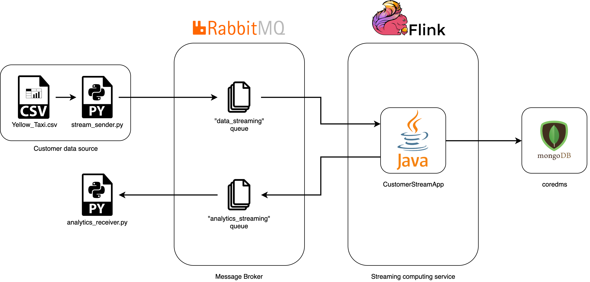
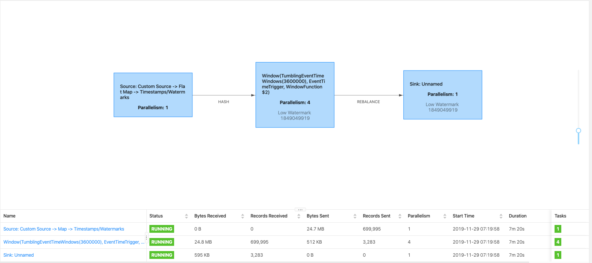
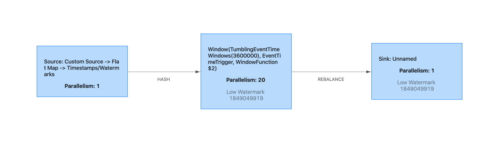

# Assignment 3 802020  
  
For this assignment, I used Python, Java, RabbitMQ and Flink. 
  
  
---  
## Part 1 - Design for streaming analytics  
  
**1) Select a dataset suitable for streaming analytics for a customer as a running example (thus the basic unit of the data should be a discrete record/event data). Explain the dataset and at least two different analytics for the customer: (i) a streaming analytics which analyzes streaming data from the customer (customerstreamapp) and (ii) a batch analytics which analyzes historical results outputted by the streaming analytics. The explanation should be at a high level to allow us to understand the data and possible analytics so that, later on, you can implement and use them in answering other questions.**
  
The chosen dataset is a modified version of the Yellow Taxi Trip Records.
I removed some columns and I keept only 700k lines for testing purposes ([dataset_v1](https://drive.google.com/file/d/1gla8axt2vr7OoQ85O5UXhkbtZk--LYit/view?usp=sharing)). Then, using a script, I changed all the dates&time data into timestamps (seconds elapsed from 1/1/1970) and I also removed the header to simplify the process ([dataset_v2](https://drive.google.com/file/d/1Im7cRDH6_i319aKNjukBjnL3-ZZ-7hxU/view?usp=sharing)). I used this final dataset as a collection of events for the stream.

An event is defined as:
 * tpep_pickup_datetime (int): date and time of the clients' pickup (expressed as the number of seconds elapsed from 1/1/1970).
 * passenger_count (int): the number of passengers in the vehicle
 * trip_distance (float): elapsed trip distance in miles
 * PULocationID (int): city zone of the pickup
 * DOLocationID (int): city zone of the destination
 * amount (float): the amount charged to passengers
  
Client: Uber-like company
Data: Every event is created and sent automatically when a client books a ride (specifying pickup place, destination and number of passengers). trip_distance, PULocationID, DOLocationID and total_amount are automatically calculated.


i) streaming analytics: the client wants to have real-time data (every hour) related to the most profitable area of the city, to be able to move his drivers in that specific area, to increase the possibility of finding clients.

Result of the analytics:
 * PULocationID (int): city zone of the pickup
 * initial_timestamp (int): timestamp of the first event recorded in the window of one hour (expressed as the number of seconds elapsed from 1/1/1970)
 * final_timestamp (float): timestamp of the last event recorded in the window of one hour (expressed as the number of seconds elapsed from 1/1/1970).
 * total_passengers (int): total number of passengers during all the travels
 * total_distance (int): total distance travelled by the driver
 * total_amount (float): total amount charged to all the clients

ii) batch analytics: every 24 hours the system returns useful statistics such as the most profitable zones, the most profitable hours or the most profitable days.

This anaysis could help to reorganize the distribution of drivers in the city and also the quantity needed during the different hours and days.

It's also possible to train, once a week or month, a machine learning model on the data to make some predictions (For example using Spark with MLlib).


**2) Customers will send data through message brokers/messaging systems which become data stream sources. Discuss and explain the following aspects for the streaming analytics: (i) should the analytics handle keyed or non-keyed data streams for the customer data, and (ii) which types of delivery guarantees should be suitable.** 

  i) the analytics will handle keyed data streams (keyed by the zone of the pickup, **PULocationID**), allowing also a parallel analysis of the data since the processing of each data related to a different **PULocationID** is independent.
  
  ii) I will implement at-most-once delivery guarantee because in our case we can accept data losses and we will have also better performances (less resource usage for handle duplicated messages). Exactly-once delivery guarantee is suitable but, since that is not strictly necessary, I decided to not implement it to reduce the complexity and the resources needed.
  
**3) Given streaming data from the customer (selected before). Explain the following issues:(i) which types of time should be associated with stream sources for the analytics and be considered in stream processing (if the data sources have no timestamps associated with events, then what would be your solution), and (ii) which types of windows should be developed for the analytics (if no window, then why). Explain these aspects and give examples.**   
  
  The dataset chosen has a field called **tpep_pickup_datetime** that represent the timestamp expressed in the number of seconds elapsed from 1/1/1970. Since I am going to use a tumbling window of one hour to analyze the streaming, the timestamp is going to be used as the main time for the analysis (the stream is going to be based on the event-time, not on the processing-time).
  
  For example, my first window will contain all the events (related only to one **PULocationID**) between the first one and the last event with a timestep less or equal to the timestep of the first event plus one hour.
  
  
  
**4)  Explain which performance metrics would be important for the streaming analytics for your customer cases.**
 
 In my case, the only useful metric to take into account would be the throughput. The throughput represents the number of observation that can be processed within a time unit. It is a very useful metrics that can be used to decide when to scale your service.
 
  
**5)  Provide a design of your architecture for the streaming analytics service in which you clarify: customer data sources, mysimbdp message brokers, mysimbdp streaming computing service, customer streaming analytics app, mysimbdp-coredms, and other components, if needed. Explain your choices of technologies for implementing your design and reusability of existing assignment works. Note that the result from customerstreamapp will be sent back to the customer in near real-time.**
  
  
  
  In the picture is shown the architecture of the system developed. For semplicity is shown only one customer, but this platform can handle multiple customers. Each customer will have his's own *stream_sender*(simulation of the data coming from every booking) and *analytics_receiver*(receiver of the real-time analysis), two rabbitMQ queue to send and receive data from the analytics and a personalized Flink app to handle his data. The database for the storage will be the same. 
  
  
  
  * **customer data source**: the data are coming from a script (`stream_sender.py`) that reads a ```.csv``` [file](https://drive.google.com/file/d/1Im7cRDH6_i319aKNjukBjnL3-ZZ-7hxU/view?usp=sharing). This is a simulation of real data coming each time a customer books a ride. These data are sent to a rabbitMQ queue, called "data_streaming".
  
  * **mysimbdp message brokers**: the message broker is represented by RabbitMQ. There will be two different queues for the client:
  
    * "data_streaming" -> this queue receives all the messages from the customer data source and it will forward them to the streaming analytics service.
  
    * "analytics_streaming" -> this queue receives the results of the analytics and it will forward them to the client frontend (`analytics_receiver.py`) where the data will be displayed (in our case printed on the terminal).
  
  This service offers also a backpressure mechanism to slow down automatically the stream if the consumer is not able to handle the stream speed.
  
  * **mysimbdp streaming computing service**: I decide to use Flink as streaming computing service. It offers what I need, so windowing mechanisms and connectors to rabbitMQ and MongoDB.
 I chose Flink instead of Spark because Spark adopts micro-batches and Flink adopt a continuous flow operative-based streaming model. As far as window criteria, Spark has a time-based window criteria, whereas Flink has record-based or any custom user-defined window criteria. Therefore, Flink is more flexible for streaming applications.
    
  
  * **customer streaming analytics app**: This component is a Java application that runs on top of Flink. I decided to use the Tuple object because they are more optimized for this type of computations and also to permit to the client to define the operation to perform on the data without telling us which are the meaning of the data (if they are sensible data). 
  
  * **mysimbdp-coredms**: The results of the analytics could be also stored in a MongoDB database, adding it as another final sink in the Flink application. However, this function is not implemented in the coding part. (the upload schema is better described in the answer 3.1)
  
  
  The components I reused are:
  * RabbitMQ on CloudAMQP
  * some readapted code used to write the scripts `stream_sender.py` and `analytics_receiver.py`
  * MongoDB deployed on Atlas MongoDB (not used in the implementation)
  
  
---  
## Part 2 - Implementation of streaming analytics
  
**1) Explain the implemented structures of the input streaming data and the output result, and the data serialization/deserialization, for the streaming analytics application (customerstreamapp) for customers.**

The input streaming is composed by the observations of the [dataset](https://drive.google.com/file/d/1Im7cRDH6_i319aKNjukBjnL3-ZZ-7hxU/view?usp=sharing). Every record is formatted as a csv line:

```
"1526389200,1,2.34,142,263,17.3"
```

The data is sent with the above serialization through the message broker (`data_streaming` queue) and then deserialized by the map function into a Tuple object.

After the elaboration of the data, is serialized again into json format using the following schema:
```
{ 
   "PULocationID":162,
   "initial_timestamp":1526389200,
   "final_timestamp":1526392488,
   "total_passengers":459,
   "total_distance":607.8198,
   "total_amount":4434.3013
}
```
Finally, the json record is sent back through the `analytics_streaming` queue and deserialized by the customer for the visualization. In our case, for simplicity, is just printed into the command line.


**2) Explain the key logic of functions for processing events/records in customerstreamapp in your implementation.** 

The input stream is mapped on a `Tuple6<Integer, Integer, Float, Integer, Integer, Float>` (using a `FlatMap`) and checking if the input data are valid (see question 2.4 for more details about the validity). After that is assigned a Watermark using the timestamp of the data (the first element of the Tupla), needed because the time used for the windows is the event-time and not the processing-time. Then, the data are divided into different streams based on the pickup location (the 4th element of the Tupla -> PULocationID) using the `keyBy`. These streams are analyzed in groups defined by a tumbling window of 1 hour. For each group of data is extracted:
 * the city zone of the pickup (PULocationID) -> equal for every entry
 * the timestamp of the first and the last events in the window (initial_timestamp and final_timestamp) -> searching the min and the max iterating over all the elements
 * the total number of passengers during all the travels (total_passengers) -> summing the number of passengers over all the elements
 * the total distance travelled by the driver (total_distance) -> summing the distance value over all the elements
 * the total amount charged to all the clients (total_amount) -> summing the amount value over all the elements
 
 These data are then sent into a sink (to the message broker).

**3)  Run customer streamapp and show the operation of the customer streamapp with your test environments. Explain the test environments. Discuss the analytics and its performance observations.**

The analytics returned to the customer by Flink:
  
  
  Let's take the second line as example:

 
   * PULocationID: 162 
   * initial_timestamp: 1526389200 -> Tuesday 15 May 2018 13:00:00
   * final_timestamp: 1526392488 -> Tuesday 15 May 2018 13:54:48
   * total_passengers: 459
   * total_distance: 607.8198
   * total_amount: 4434.3013

  From the zone number 162, the 15th of May between 13:00:00 and 13:54:48, 459 people have been transported, 607.8 miles travelled and 4434.30 $ earned.
  
  Test environment: the test environment consists in a data streaming created from a file csv (the speed could be changed modifying the sleep function in the script but in this case since we are taking into account the event time and not the processing time), then serialized, transported using rabbitMQ to Flink. Then the data are analyzed and returned serialized (Json format), deserialized by the analytics_receiver and printed on the command line. 
  
  We can have some data about the queue from the web interface of rabbitMQ and some information about the processing from the web interface of Flink (see question 2.5)
  
**4) Present your tests and explain them for the situation in which wrong data is sent from or is within data sources. Report how your implementation deals with that (e.g., exceptions, failures, and decreasing performance). You should test with different error rates.**

Test: I modified the stream_sender to send, with a settable probability (error rate), incorrect data to the queue (file called `stream_sender_test_errors.py`). Therefore, I tested my implementation running the test environment multiple times using `stream_sender_test_errors.py` (instead of `stream_sender.py`) with different error rates.
The Flink app has a validation control on the input data (inside the `FlatMap`): the input string should be a csv line, formed by 6 elements, all of them numerical. If this is false, the input data is discarded.


`Input with errors`


`Input filtered by the FlatMap`


From my tests, with different error rates, I noticed only a small decrease of performance, probably due to the additional computation.


**5) Explain parallelism settings in your implementation and test with different (higher) degrees of parallelism. Report the performance and issues you have observed in your testing environments.**
  
  My implementation implements a parallelism of 1 for the data receiver, for the mapping and for the watermark'operations. Then, after the keyBy, the parallelism became equal to 4. All the windows functions are executed in parallel and the parallelism returns to 1 only when the results reach the Sink. The picture below shows the structure of the workflow.
  
  
  
  
  Incrementing the parallelism (as shown in the picture below, reaching a parallelism of 20) the performances are not increasing. Instead, the performances are decreasing. this is since the parallelism should be equal to the number of processors available. In my case, 4 is the perfect number because my machine only has 4 cores. 
  
  

## Part 3 - Connection


**1)  If you would like the analytics results to be stored also into mysimbdp-coredms as the final sink, how would you modify the design and implement this (better to use a figure to explain your design).**
    
  
  
  As shown in the schema, I would send the analytics on a new queue in RabbitMQ and then I would read them and ingest them using a python script called `analytics_uploader.py`
  I chose this approach instead of the direct upload using a sink from the Flink app for 2 main reasons:
  * with the queue approach we can exploit the backpressure feature of RabbitMQ
  * we can decide to upload the file in batch, reducing the number of messages to send to MongoDB
    
**2) Given the output of streaming analytics storedinmysimbdp-coredmsforalongtime. Explain a batch analytics (see also Part 1, question 1) that could be used to analyze such historical data. How would you implement it?** 

 The batch analytics would run every 24 hours. The system returns useful statistics such as:
  * the most profitable zones -> it will return a dictionary containing every zone with the relative total profits
  * the most profitable hours -> it will return a dictionary containing every hour of the day with the relative total profits (averaged on all the days)
  * the most profitable days -> it will return a dictionary containing every day of the week with the relative total profits (averaged on all the weeks)


  
  
  To perform the batch analytics, I will use Spark because is more suitable for this use case (it was designed for batch analytics). Since Spark and Hadoop HDFS allows to perform efficient parallel computation on large amounts of data and Flink is also compatible, for this application I would choose as database Hadoop HDFS instead of MongoDB.
  The result of the analysis could be sent directly to the user or also stored on the database.
  
    
    
    
**3)**   Assume that the streaming analytics detects a critical condition (e.g., a very high rate of alerts) that should trigger the execution of a batch analytics to analyze historical data. How would you extend your architecture in Part 1 to support this (use a figure to explain your work)?.
    


I will launch from the Flink app a bash script that will start the Spark application. Every specific error will launch a specific bash script that will launch a specific batch analysis, passing some parameters.
    
**4)**  If you want to scale your streaming analytics service for many customers and data, which components would you focus and which techniques you want to use?
    
  I will focus mainly on these components:
  
  * I will scale the message broker (RabbitMQ) horizontally.
  * I will configure an orchestrator, like Kubernetes and I will run on top of it Docker containers of Flink and Spark (if needed). Doing so, the system will be automatically able to scale according to some metrics (e.g. throughput).
  
  
    
**5)**  Is it possible to achieve end-to-end exactly-once delivery in your current implementation? If yes, explain why. If not, what could be conditions and changes to make it happen? If it is impossible to have end-to-end exactly-once delivery in your view, explain why.

Yes, it is possible. To obtain an at-least-once guarantee, we have to focused on three main points:

* we have to use the acknowledgement mechanism functions offered by the RabbitMQ and Flink
* we have to avoid duplicated messages (exploiting a deduplication mechanism)
* we have to forbid parallelism

The instruction to achieve exactly-once guarantees with the RabbitMQ source, provided by the [official documentation page](https://ci.apache.org/projects/flink/flink-docs-stable/dev/connectors/rabbitmq.html) of Flink, are the followings:
* Enable checkpointing: With checkpointing enabled, messages are only acknowledged (hence, removed from the RabbitMQ queue) when checkpoints are completed.
* Use correlation ids: Correlation ids are a RabbitMQ application feature. You have to set it in the message properties when injecting messages into RabbitMQ. The correlation id is used by the source to deduplicate any messages that have been reprocessed when restoring from a checkpoint.
* Non-parallel source: The source must be non-parallel (parallelism set to 1) in order to achieve exactly-once. This limitation is mainly due to RabbitMQ’s approach to dispatching messages from a single queue to multiple consumers.


## How to run


Requirements:

- RabbitMq version: 3.7.18

- Python version: 3.7

- Flink version: 1.9.1

- Java version: 8+

- Maven

From the folder where Flink is installed
 * if you want to change the number of Task Managers add them here `libexec/config/slaves`
 * if you want to change the number of tasks for each Task Manager modify this file: `libexec/config/flink-conf.yaml` (see picture below)


start the cluster
 ```console
 libexec/bin/start-cluster.sh
 ```


From the root folder of the project:
 -run:
 ```console
 pip install requirements.txt
 ```

From `assignment-3-802020/code/customerstreamapp` execute this to run your Flink app:

 ```console
 mvn clean install
flink run target/customerstreamapp-0.1-SNAPSHOT.jar
 ```

From `assignment-3-802020/code/scripts` run 
 ```console
 python3 analytics_receiver.py
 ```
to run the analytics receiver


From `assignment-3-802020/code/scripts` run 
 ```console
python3 stream_sender.py <path_to_the_dataset>
 ```
to run the stream sender

To test the situation in which wrong data is sent from or is within data sources

From `assignment-3-802020/code/scripts` run 
 ```console
python3 stream_sender_test_errors.py <path_to_the_dataset> <error rates (probability from 0 to 1)>
