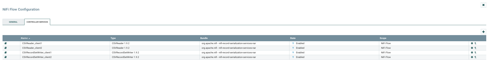

## How to run


Requirements:
- MongoDB version: 4.0.12

- RabbitMq version: 3.7.18

- NiFi version: 1.9.2

- Python version: 3.7


From the root folder of the project:
 -run:
 ```console
 pip install requirements.txt
 ```


---
## Part 1 - Ingestion with batch

**To test: TODO: move to deployment file**
remember to run from ./assignment-2-802020/code/


From the ./assignment-2-802020/code/ folder:

- run NiFi
- using the graphical interface at http://localhost:8080/nifi/, load the file called "mysimbdp-fetchdata.xml" (present in the code folder) as a template
- create a template using the one you just upload
- run all the services (picture below)

- run the NiFi flow
- run 
```console
python3 mysimbdp-batchingestmanager.py
```
- create different copy of the datasets (present in the folder called "data") and put them into the right client-input-directory (set in NiFi as explained in Assignment-2-Design.md)

- the files should disappear and after a while the will be uploaded to the database.

- the logs of NiFi could be found inside its installation folder, in the "logs" folder


---
## Part 2 - Near-realtime ingestion


-run to open API_ENDPOINT for clientstreamingestapp -> http://127.0.0.1:5000/upload
```console
python3 mysimbdp-databroker.py
```
- run
```console
python3 mysimbdp-dynamicmanager.py
```


**TEST WITH LOCUST**  

- run:
 ```console
locust -f test_clientstreamingestapp.py --host http://127.0.0.1:5000
```    
than open the broswer here "http://localhost:8089/" and choose the number of users to simulate

- run for all the client (in the example 'client1' and 'client2')
 ```console
python3 mysimbdp-streamingestmanager.py <client_id> stop_all
```  
to close all the proccesses still open
   
   
   
   
    