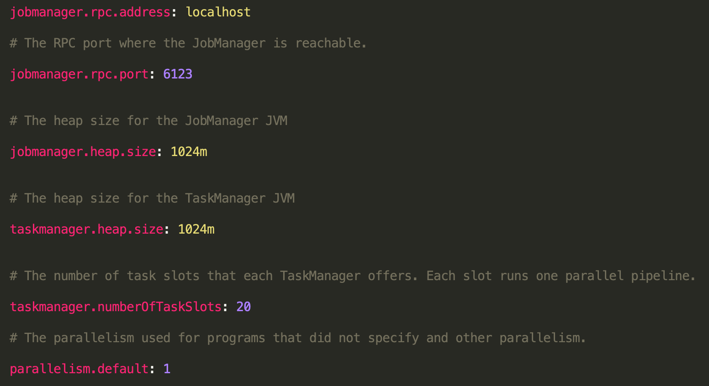

## How to run


Requirements:

- RabbitMq version: 3.7.18

- Python version: 3.7

- Flink version: 1.9.1

- Java version: 8+

- Maven

If you want to use another RabbitMQ deployment, instead of the one in the code (A CloudAMQP instance, https://www.cloudamqp.com/), change the reabbitMQ URI in:
* `code/scripts/stream_sender.py`
* `code/scripts/stream_sender_test_errors.py`
* `code/scripts/analytics_reciever.py`
* `code/customerstreamapp/src/main/java/fi/aalto/cs/cse4640/CustomerStreamApp.java`

From the folder wher Flink is installed
 * if you want to change the number of Task Managers add them here `libexec/config/slaves`
 * if you want to change the number of tasks for each Task Manager modify this file: `libexec/config/flink-conf.yaml` (see picture below)



start the cluster
 ```console
 libexec/bin/start-cluster.sh
 ```


From the root folder of the project:
 -run:
 ```console
 pip install requirements.txt
 ```

From `assignment-3-802020/code/customerstreamapp` execute this to run your Flink app:

 ```console
 mvn clean install
flink run target/customerstreamapp-0.1-SNAPSHOT.jar
 ```

From `assignment-3-802020/code/scripts` run 
 ```console
 python3 analytics_receiver.py
 ```
to run the analytics receiver


From `assignment-3-802020/code/scripts` run 
 ```console
python3 stream_sender.py <path_to_the_dataset>
 ```
to run the stream sender

To test the situation in which wrong data is sent from or is within data sources

From `assignment-3-802020/code/scripts` run 
 ```console
python3 stream_sender_test_errors.py <path_to_the_dataset> <error rates (probability from 0 to 1)>
 ```