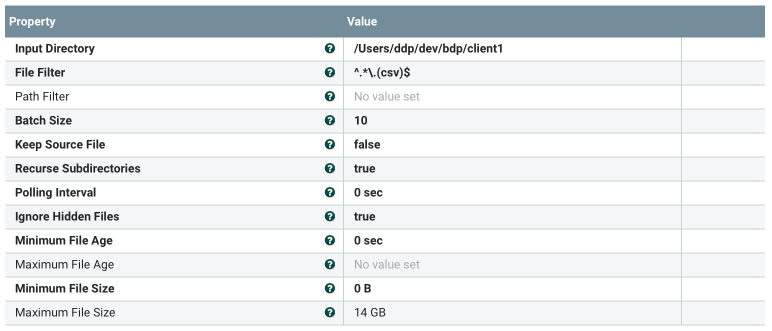
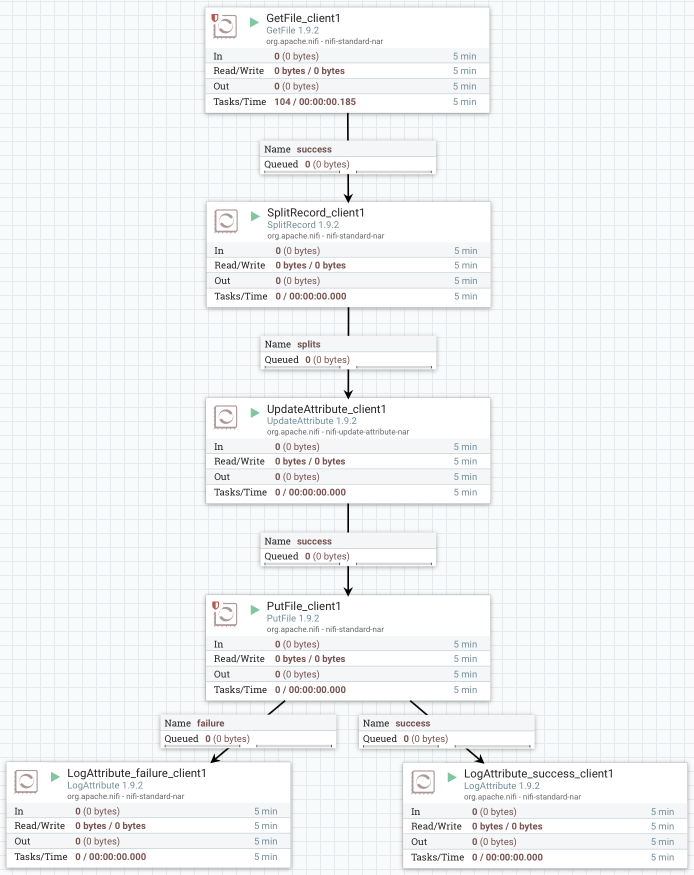
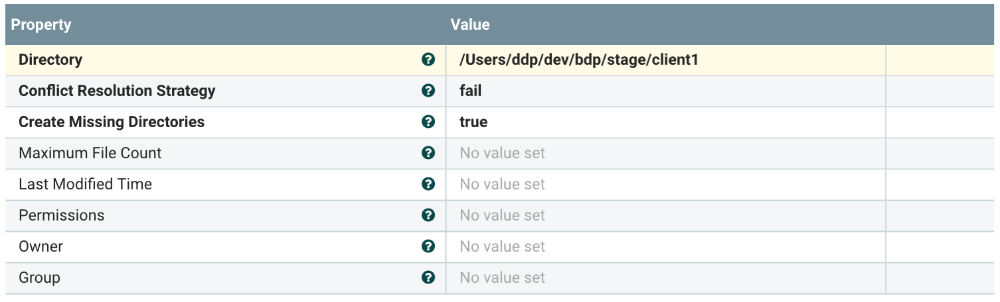
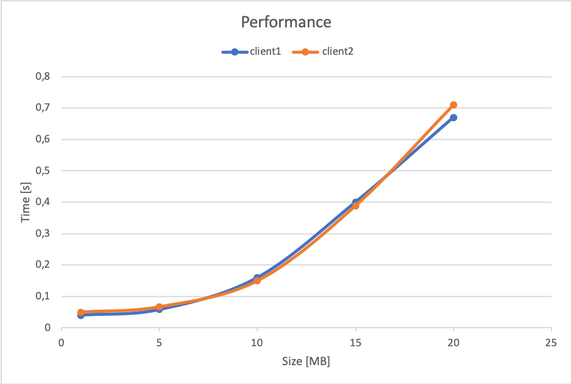
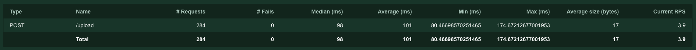
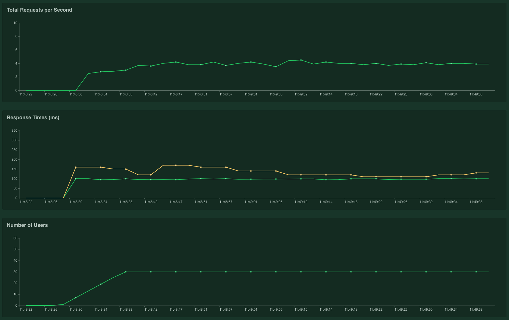
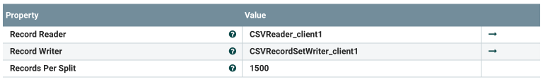

# Assignment 2 802020

For this assignment I used Python, RabbitMQ, NiFi and Mongodb. The datasets I chose are the [Indoor Localization Dataset](https://zenodo.org/record/2671590#.XXJahPxRUlU) for client1 and a version mobified by me of [Films Dataset](https://perso.telecom-paristech.fr/eagan/class/igr204/datasets) for client2.


---
## Part 1 - Design for streaming analytics

**1)** The constraints I chose for files which should be ingested:
- the extension should be ".csv"
- the dimension should be less than 14 GB for client1 and 10 GB for client2 (defined by the SLA)

Since I used Nifi to implement mysimbdp-fetchdata, I set the previous constraints inside the XML configuration file of NiFi (see properties "File Filter" and ""Maximum File Size" in the picture below).



For the customer service profile I defined a json file which contains:
- the URI for mongodb (with username and password incorporated)
- the name of the database
- the URI for rabbitMQ
- the name of the queue reserved to the client

Format of the json file "<client_name>_config.json":


```json
{
   "mongo_uri":"...",
   "mongo_db_name":"...",
   "rabbit_uri":"...",
   "queue":"..."
}
```

These files are located here:

```
|-- assignment-2-802020
    |-- code
        |-- config_files
            |-- client1_config.json
            |-- ...
```

**2)** For this question the solution is implemented using NiFi. Apache NiFi is a software project designed to automate the flow of data between software systems.
In the picture below is shown the structure of the implemented flow used to move the file from the client folder to mysimbdp.


 
This flow begins from the client folder, set in 'Input Directory' property of GetFile (as shown in the picture in question 1).
The flow passes through SplitRecord and UpdateAttribute (see explanation of this componens below, in the second request for the bonus points) reaching PutFile, that will put files in the stage directory (set in 'Directory' property of PutFile, as shown in the picture below).



The stage directory will have a folder for each client:
```
|-- stage
    |-- client1
        |-- locations_1.csv
        |-- ...
    |-- client2
        |-- films_1.csv
        |-- ...
    |-- ...
```

The two LogAttributes are creating the logs file. More details in question 4.

**3)** The component mysimbdp-batchingestmanager is a daemon that checks every 5 seconds if there are any elements in the stage folder.
If it found a file, it will be sent as argument to the clientbatchingestapp of the right client.

The customers has to develop a script called clientbatchingestapp_<client_name>.py that accepts in input 2 arguments:

- the path of the file to ingest
- the configuration file path (called <client_name>_config.json) defined by mysimbdm (defined in question 1)

clientbatchingestapp_<client_name>.py has to perform a bulk ingestion (of the data in the file) in the database (using the parameters from the configuration file).

**4)**
I created 2 different scripts for client1 and client2 called clientbatchingestapp_client1.py and clientbatchingestapp_client2.py.
These files are located here:

```
|-- assignment-2-802020
    |-- code
        |-- clientbatchingestapps
            |-- clientbatchingestapp_client1.py
            |-- clientbatchingestapp_client2.py
```
These files follows the specification defined in the previous question.

client1 will upload data from the Indoor Localization Detection Dataset, client 2 will upload data from the Film Dataset.
These datasets are located here:

```
|-- assignment-2-802020
    |-- code
        |-- data
            |-- film.csv
            |-- Indoor_Location_Detection_Dataset.csv
```

Example of data structure for Indoor_Location_Detection_Dataset.csv:
```json
{
    "part_id": "56709",
    "ts_date": "20180315",
    "ts_time": "19:02:36",
    "room": "bathroom"
}
```

Example of data structure for film.csv:
```json
{
    "Year": "1991",
    "Length": "105",
    "Title": "Predator 2",
    "Subject": "Action"
}
```

**Performance of ingestion**


The 2 clients, having similar data and accessing to the same database, have analog results.

- % Successes = 100%
- % Failures = 0%


The mysimbdp-batchingestmanager.log into the log folder will contain more informations. 

**5)**
All the logs files (NiFi, mysimbdp-batchingestmanager.log,..) are in the "log" folder


---
## Part 2 - Near-realtime ingestion

**1)**
For the near-realtime ingestion I decide to give the possibility to the customer to send a single record per message.
The customer will have to incapsulate into a json file their client ID and the data. Then, they will have to send this json to an API provided by mysimbdp.

The json format will be the following (example with client1 data from Indoor_Location_Detection_Dataset.csv):

```json
{
    "user_id": "client1",
    "data": {
        "part_id": "56709",
        "ts_date": "20180315",
        "ts_time": "19:02:36",
        "room": "bathroom"
    }
}
```
The API provided by mysimbdp is a Flask server with 1 endpoint:

- POST: http://localhost:5000/upload - input: json document formatted as described above
    - This endpoint permits to send a document to the rabbit queue of the client

I chose this design because the clients will not need to contact directly rabbitMQ, but they will simply contact a standard API.
Furthermore, if the clients will augment, it will be easy to scale horizontally, creating other instances of the server.

**2)**
The component mysimbdp-streamingestmanager is implemented in mysimbdp-streamingestmanager.py and it will start or stop instances of clientstreamingestapp_<client_name>.py

To code to launch it is the following:

 ```console
python3 mysimbdp-streamingestmanager.py <client_id> <action>
```  

The 2 arguments represent:

- client_id: the id of the client related to the script to be started / stopped
- action: the action to be performed. There are 3 possible actions:
    - start: it will start a new instance
    - stop: it will terminate one instance (if only one instance remains, it does nothing)
    - stop_all: it will terminate all the running instances


**3)**
It's been developed, using locust, a simple test for the real time ingestion (test_clientstreamingestapp.py). The test will run 15 instances of client 1 ingestion and 15 instances of client 2 ingestion
(every one o this agents will have a probability to send a new request after a random time between 5 and 10 seconds)

Results:






- % Successes = 100%
- % Failures = 0%

**4)**
clientstreamingestapp decides to report:
 - the its processing rate
 - average ingestion time
 - total ingestion data size
 - number of messages to mysimbdp-streamingestmanager within a pre-defined period of time
 
 The design of the report is defined as follows:

```json
{
    "client_id": string,
    "proc_rate": float,
    "avg_ingest_time": float,
    "tot_data_size": int,
    "n_mess": int
}
```
where:
- client_id -> client id used to identify the instance
- proc_rate -> processing rate (bit/s)
- avg_ingest_time -> average ingestion time (seconds)
- tot_data_size -> total ingestion data size (bit)
- n_mess -> number of messages
All these parameters are calculated within a pre-defined period of time (30 seconds)

The communication mechanism for the reporting is rabbitMQ. The differents clientstreamingestapps will send the report to a queue called "reports".

**5)**
A daemon called mysimbdp-dynamicmanager will connect to the "reports" queue of rabbitMQ and analyze all the reports. If specific values are over or under a threshold, it will start or stop a clientstreamingestapp process.
In particular:
- if n_mess > 30, mysimbdp-dynamicmanager will run 
 ```console
python3 mysimbdp-streamingestmanager.py <client_id> start
```  
- if n_mess < 5, mysimbdp-dynamicmanager will run 
 ```console
python3 mysimbdp-streamingestmanager.py <client_id> stop
```  

Therefore, if a process will have more than 30 requests during the pre-defined time period, it will start a new instance of the clientstreamingestapp.
Instead, if a process will have less than 5 requests during the pre-defined time period, it will stop an instance of the clientstreamingestapp.

(the files "<client>_PID.txt" are used to store the process ID of the different process that are running)

---
## Part 3 - Integration and Extension

**1)**
The architecture will look like the Lambda architecture (in the picture), that is a data-processing architecture designed to handle massive quantities of data by taking advantage of both batch and stream-processing methods.

In our case the Batch processing will be formed by mysimbdp-fetchdata, mysimbdp-databroker and mysimbdp-batchingestmanager and it will be used to store data.
Speed (Real-time) Processing will be formed by mysimbdp-streamingestmanager and mysimbdp-dynamicmanager and it will be used for real-time analysis on the data (for example with Spark).

**2)**
In this case I will use the microbatching (developed for the bonus points) to divide the file in smaller parts.
This will permit to move the data easily in smaller batches. I will not exploit the near real-time component because, sending all the chunks 
through the message broker, it will slow down the whole system.

**3)**
A platform provider should not see the code of the customer because it could contain sensitive information about the company or even some trade secrets.
Furthermore, running a process into a container (e.g. docker), will give to the platform the confidence to be protected, even if the code il malicious.

The only use case in which I can assume to know the code is if the company decides to assign me (the platform provider) the develop of their applications.

**4)** I would provide to the company precise guidelines and the schema they have to implement for the ingestion.
I will check all the parameters I have access to and I will decline all the requests that are not satisfying the requirements. 


**5)** For the clientstreamingestapp I would add a field to the json they will send to the API, that specifies the type of message.
For every type of message I will use a specific queue of the message broker, that will be connected with the specific clientstreamingestapp.

 For the clientbatchingestapp I would codify in the name of the file its type.
 Therefore, when the file will be in the stage folder, I will be able to choose the right clientbatchingestapp to launch.
 

---
## Bonus points

**1) Design and implement the dynamic management of instances for Part 2/Question 5**

See answer 2.5

**2) Develop the solution that automatically switch from batch to microbatching based on a set of constraints (e.g., file size, time, bandwidth)**

To solve this problem I added to my NiFi schema the SplitRecord module. This module will divide a file, following some constraints, into smaller files. Then, all these the files will be sent to the staging folder.
The constraint, defined in the NiFi configuration (showed in the picture below), is:

- Record Per Split: 1500 -> maximum number of rows per file




Therefore, the system will:
- move directly all the files with less than 1500 rows (batching).
- reduce the dimension of all the files with more than 1500 rows and than send them to the staging directory (microbatching).

Thus, the system able to switch automatically from batching to microbatching following some constraints.

(UpdateAttribute changes the name of the file to avoid that 2 files inside the stage folder will have the same name)
---

